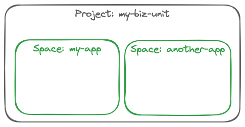

Before we can deploy any applications, we need to log in to the platform and set our project and space.  Normally, you would just issue a `tanzu login`, let the CLI open a browser window for you, log in to the Cloud Services Platform (CSP), and your browser would redirect you to a local listener that the Tanzu CLI sets up to accept the token generated for your login.  

```
tanzu login
```

Now, in the terminal session that we ran the login command in, paste your copied token, and press enter.



Tanzu Platform has a few different organizational structures that enable developers to focus on the resources for their applications.  First, Tanzu Platform manages the clusters and resources you have access to in top-level *Projects*.  Within a Project, there are logical locations to deploy your application components called *Spaces*.  Before we can do much else, we need to target the Tanzu CLI at the project and space assigned to you for your application work.

You can see all the projects you have access to by listing them with the following command:
```execute
tanzu project list
```
```
tanzu project use AMER-PubSec
```

Now, we need to target a space.  You can list out the spaces available with the following command:
```
tanzu space list
```

Your platform engineering team has already created a space for you as well. Let's target that space:
```
tanzu space use yoursapce
```

Finally, we need to set one final configuration to get started.  We need to specify the container registry to be used for storing the application containers and deployment manifests built for you by Tanzu Platform. In our environment, our platform engineers have configured the platform with a build plan stored remotely, in the so-called Universal Control Plane (or UCP). The build plan uses Cloud Native Buildpacks and applies some common conventions for Spring applications.  However our business unit has its own container registry service, so we need to configure the Tanzu CLI to know where that registry is.  Luckily, we already have the location of this registry in an environment variable, and we've already logged into that registry using the Docker CLI. So let's execute the following command to configure the Tanzu CLI to use our registry.