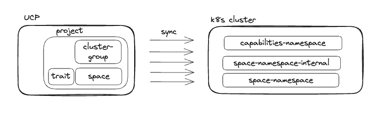
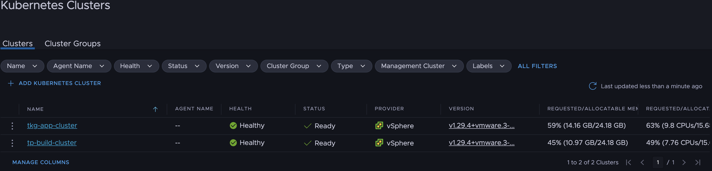

# Platform Engineer Hands-on Lab

All workshop participants to verify they are all set with steps in [Workshop Attendee pre-requisites](../lab-platform-engineer/00-prerequisites.md#workshop-attendee-pre-requisites)

## Log in the Tanzu Platform for Kubernetes 
On the browser, open a new tab/window and go to the Tanzu Platform for k8s URL you've been given at the begining of the workshop. Log in. Then make sure to select the Organization, and later the Project you've been assigned.

Once that's done, open a terminal and run this commands, use the Organziation ID you've been given:
```
export TANZU_CLI_CLOUD_SERVICES_ORGANIZATION_ID=XXXX
tanzu login
```

The Tanzu CLI and the plugins we use interact with the Tanzu Platform Unified Control Plane as a K8s API. The the CLI keeps the KUBECONFIG configuration and the contexts to interact with thsi UCP in `~/.config/tanzu/kube/config`. When we run the the use sub-commands of project, space and clustergroup plugins, we are adjusting the context to point to the right level of the hierarchy of resources in UCP:
```
Organization
|
 -- Projects
    |
     -- Spaces / Cluster Groups
```

Check what happens with the Tanzu CLI context when you target a project
```
tanzu project use
# choose a valid project from the list, e.g: AMER-Pubsec
tanzu context current | grep -E "Kube Context"
#  Kube Context:    tanzu-cli-sa-tanzu-platform:AMER-Pubsec
```

More on this in the [documentation](https://techdocs.broadcom.com/us/en/vmware-tanzu/platform/tanzu-platform/saas/tnz-platform/spaces-how-to-tanzu-cli-contexts-create-and-manage-cli-contexts.html)

During this workshop we will also use `kubectl` to access some UCP resources. To be able to do that you can set your `KUBECONFIG` environment variable to point to that `~/.config/tanzu/kube/config` file. Or even create an alias to only use that `KUBECONFIG` when you need to check UCP resources, and leave the default KUBECONFIG (`~/.kube/config`) for regular use of kubectl to access the k8s clusters:
```
alias tk='KUBECONFIG=~/.config/tanzu/kube/config kubectl'
```

Throughout this lab of the workshop you will see how there are many resources that are created at UCP level, and automatically copied over, and kept in sync, in the k8s clusters where applications will run. At a high level:


## Tanzu Platform Concepts and Relationships to keep handy
As a Platform Engineer we need to be able to configure the Platform and prepare repeatable and configurable environmments for the application team to deploy applications into. These are the Spaces. But they are not the only construct that Platform Engineers need to get familiar with. Throughout this lab we will get introuced to all of them through the lens of the Platform Engineer. At a high level we need to know what these are:
- Cluster Groups: are groupings of Kubernetes Clusters with provided Software (Capabilities) installed on those Clusters. They enable platform engineers to curate what combination of Capabilities will be provided by their platform.
- Capabilities: are named groups that describe the APIs and features available from the Platform.
    - In order to curate the APIs available to users, Spaces require Capabilities (indirectly, via profiles). This has the effect of determining precisely which Kubernetes APIs will be exposed to users and their tools in a given Space.
    - In order to support the APIs required to run the applications and handle the resources within a Space, Clusters provide Capabilities. A Cluster that provides Capabilities ensures the Custom Resource Definitions (CRDs) and their respective controllers are available to the applications that run in a Space on that cluster.
- Availability Targets:  are groupings of Clusters that allow users to define where their application will be scheduled
    - Spaces include Availability Targets to describe where they should be scheduled. This has the effect of determining which clusters, in a specific physical or logical location, should be used as a target for the Space.
- Profiles: are groupings of required Capabilities that have a consistent, semantic meaning within an organization. They enable platform builders to curate what workload characteristics will be supported by their platform and for users to reference those characteristics without knowing details about how they are implemented.
    - Spaces include Profiles to describe the characteristics (in the form of Capabilities) of the Space. This has the effect of adding required Capabilities to the Space and influencing where it is scheduled; Spaces transitively require all Capabilities that are required by any Profiles a Space includes.
- Traits: are collections of Kubernetes resources that are deployed into Spaces when they are created. They deliver required, pre-configured, and consistent content to Spaces.
    - Profiles include Traits to deploy reusable content into Spaces when they are scheduled. This has the effect of automating the configuration and creation of Kubernetes resources, for users.


Here's a conceptual diagram with how these relate to each other:


More on this in the [Tanzu Application Engine Conceptual Overview documentation](https://techdocs.broadcom.com/us/en/vmware-tanzu/platform/tanzu-platform/saas/tnz-platform/spaces-concepts-index.html)

## Networking

Navigate to "Setup and Configuration" -> Networking

- Create a certificate provider
    -  name: copy name of your domain from spreadsheet
    - Certificate: copy the certificate provided in spreadsheet for your domain
    - key: copy key from spreadsheet
- Create a domain
    - name: copy name of your domain from spreadsheet
    - DNS Provider: select jklanding.com
    - Certificate provider: Select your certificate provider from drop down
    - subdomains: turn off auto-assignable
    - allowed Subdomains: *
    - ports: turn off Auto-assignable
    - allowed ports: 443
    - Allowed spaces: *


In a day in the life of a Platform Engineer we will start by creating a Cluster Group, to structure the underlying Kubernetes infrastructure and define the Capabilities we want to install and expose to the Application teams.

## Prepare a Cluster Group with required capabilities

#### Create Cluster Group
[Official documentation](https://techdocs.broadcom.com/us/en/vmware-tanzu/platform/tanzu-platform/saas/tnz-platform/spaces-how-to-operate-clusters-create-run-cluster-group.html)

Access the Hub GUI: `Infrastructure > Kubedrnetes Clusters > Add Cluster Group`. Choose a name that's unique for you (e.g: name-cg)

Make sure to enable Tanzu Application Engine.

Alternatively you can do this via CLI. Follow this commands using the `cluster-group.yaml` sample template file included in this folder of the repo, make sure to change the `fullName.name`:
```
tanzu project use 
# follow the interactive menu to select the project you've been assigned to

tanzu operations clustergroup create -f templates/cluster-group.yaml
```

#### Add capabilities to Cluster Group
[Official documentation](https://techdocs.broadcom.com/us/en/vmware-tanzu/platform/tanzu-platform/saas/tnz-platform/spaces-how-to-operate-clusters-create-run-cluster-group.html#add-capabilities)

To do this from the Hub GUI, go to: `Application Spaces > Capabilities > Available`. We can only add capabilities one by one, and curerntly you can only select a specific version, which will actually pin that version in the installed packages, which can cause issues when new Capability versions are released and their pacages bumped in the Platform (UCP).

Therefore we will do this via CLI

We need to install all capabilities that we are going to need in the Spaces we want to create. Spaces request capabilities via Profiles and looking at the profiles we need to use in the workshop, these are the capabilities we want to look at:
- Capabilities needed by the GSLB ingress Profile an its traits and capabilities
    - Certificate Manager (several depend on this capability)
    - Egress
    - Ingress
    - Gateway API
- Additional Capabilities needed by the spring-dev profile: observability and carvel-package traits, and other capabilities
    - Observability
    - Service Mesh Observability
    - Mutual TLS
    - Bitnami
    - Container Apps
    - Service Binding (Tanzu Service Binding Dependency)
    - Tanzu Service Binding
    - Spring Cloud Gateway.tanzu.vmware.com (can be skipped if not needed by app)
    - Crossplane (Bitnami's dependency)
> Note: Ingress and Service Mesh Observability capabilities are all provided by the same `tcs` meta package today

To install the necessary capabilities run these commands
```
# select project
tanzu project use 
# follow the interactive menu to select the project you've been assigned to

# select cluster group 
tanzu operations clustergroup use
# follow the interactive menu to select the cluster gorup we just created

# install capabilities - version is mandatory: you can pin a specific version or use the '>' operator
tanzu package install cert-manager.tanzu.vmware.com -p cert-manager.tanzu.vmware.com -v '>0.0.0'
tanzu package install k8sgateway.tanzu.vmware.com -p k8sgateway.tanzu.vmware.com -v '>0.0.0'
tanzu package install tcs.tanzu.vmware.com -p tcs.tanzu.vmware.com -v '>0.0.0'
tanzu package install egress.tanzu.vmware.com -p egress.tanzu.vmware.com -v '>0.0.0'
tanzu package install observability.tanzu.vmware.com -p observability.tanzu.vmware.com -v '>0.0.0'
tanzu package install mtls.tanzu.vmware.com -p mtls.tanzu.vmware.com -v '>0.0.0'
tanzu package install crossplane.tanzu.vmware.com -p crossplane.tanzu.vmware.com -v '>0.0.0'
tanzu package install bitnami.services.tanzu.vmware.com -p bitnami.services.tanzu.vmware.com -v '>0.0.0'
tanzu package install container-apps.tanzu.vmware.com -p container-apps.tanzu.vmware.com -v '>0.0.0'
tanzu package install servicebinding.tanzu.vmware.com -p servicebinding.tanzu.vmware.com -v '>0.0.0'
tanzu package install tanzu-servicebinding.tanzu.vmware.com -p tanzu-servicebinding.tanzu.vmware.com -v '>0.0.0'
tanzu package install spring-cloud-gateway.tanzu.vmware.com -p spring-cloud-gateway.tanzu.vmware.com -v '>0.0.0'
tanzu package install ingress.tanzu.vmware.com -p ingress.tanzu.vmware.com -v '>0.0.0'
```

After commans run return to the GUI (`Application Spaces > Capabilities > Installed`) to see all capabilities `Ready`. If the drop down menu does not show your Cluster Group, edit and go to this url with your cluster name as parameter:
```
https://www.platform.tanzu.broadcom.com/kubernetes-operations/cluster-groups
```
You should see something like this:


Via command line you can check all the Packages (pkgi resource) for those Capabilities are created by running these commands:
```
alias tk='KUBECONFIG=~/.config/tanzu/kube/config kubectl'
tk get pkgi
NAME                                    PACKAGE NAME                            PACKAGE VERSION   DESCRIPTION   AGE
cert-manager.tanzu.vmware.com           cert-manager.tanzu.vmware.com                                           2m8s
k8sgateway.tanzu.vmware.com             k8sgateway.tanzu.vmware.com                                             2m7s
tcs.tanzu.vmware.com                    tcs.tanzu.vmware.com                                                    2m5s
egress.tanzu.vmware.com                 egress.tanzu.vmware.com                                                 2m5s
observability.tanzu.vmware.com          observability.tanzu.vmware.com                                          2m4s
mtls.tanzu.vmware.com                   mtls.tanzu.vmware.com                                                   2m4s
crossplane.tanzu.vmware.com             crossplane.tanzu.vmware.com                                             2m2s
bitnami.services.tanzu.vmware.com       bitnami.services.tanzu.vmware.com                                       2m2s
container-apps.tanzu.vmware.com         container-apps.tanzu.vmware.com                                         2m
servicebinding.tanzu.vmware.com         servicebinding.tanzu.vmware.com                                         119s
tanzu-servicebinding.tanzu.vmware.com   tanzu-servicebinding.tanzu.vmware.com                                   118s
spring-cloud-gateway.tanzu.vmware.com   spring-cloud-gateway.tanzu.vmware.com                                   117s
```

## Attach a self managed cluster in your Cluster Group
[Official documentation](https://techdocs.broadcom.com/us/en/vmware-tanzu/platform/tanzu-platform/saas/tnz-platform/data-sources-attach-k8s-cluster-data-source.html)

Access the Hub GUI: `Infrastructure > Kuberentes Clusters > Clusters > Add Kubernetes Cluster > Add self-managed cluster`:


#### Confirm cluster is onboarded to the Platform
1. Confirm the Cluster is Healthy and Ready
    - Access the Hub GUI: `Infrastructure > Kubernetes Clusters > Clusters` and confirm it's `Healthy` and `Ready`.
        
    - CLI path: check status conditions
        ```
        tanzu project use <project-name>
        tanzu operations cluster get <cluster-name>
        ```
    - CLI path: check status conditions
        ```
        tanzu operations clustergroup use <cluster-group-name>
        alias tk='KUBECONFIG=~/.config/tanzu/kube/config kubectl'
        tk get kubernetesclusters <cluster-name> -oyaml | yq .status.conditions
        # this actually doesn't show the collector online status.
        ```

#### Confirm via UCP that capabilities defined in cluster group are provided by the Cluster

To check the cluster has all the capabilities we initially defined at cluster-group level, run the following commands:
```
tanzu project use <project-name>
tanzu operations clustergroup use <cluster-group-name>
alias tk='KUBECONFIG=~/.config/tanzu/kube/config kubectl'
tk get kubernetesclusters <cluster-name> -oyaml | yq .status.capabilities
```

#### Inspect Packages and Agents intalled
1. Acccess the target cluster. Two ways:
    ```
    vsphere login --server=192.168.100.13 --insecure-skip-tls-verify --tanzu-kubernetes-cluster-name tkg-app-cluster

    user: 
    pwd: 

    kubectl config use-context tkg-app-cluster
    
    ```
        
2. Check the following namespaces
```
kubectl get ns
# make sure these namespaces exist - they are the additional namespaces created by UCP/TMC
NAME                           STATUS   AGE
cert-manager                   Active   15h   # added from capabilities
crossplane-system              Active   15h   # added from capabilities
istio-cni-system               Active   15h   # added from capabilities
istio-system                   Active   15h   # added from capabilities
service-bindings               Active   15h   # added from capabilities
spring-cloud-gateway           Active   15h   # added from capabilities
tanzu-cluster-group-system     Active   15h   # added from ucp
tanzu-containerapp             Active   15h   # added from capabilities
tanzu-egress                   Active   15h   # added from capabilities
tanzu-service-bindings         Active   15h   # added from capabilities
tanzu-system                   Active   15h   # added from ucp
vmware-system-tmc              Active   15h   # added from tmc
```

3. Check the following packages
```
kubectl get pkgi -A
NAMESPACE                    NAME                                              PACKAGE NAME                                  PACKAGE VERSION                DESCRIPTION           AGE
tanzu-cluster-group-system   bitnami.services.tanzu.vmware.com                 bitnami.services.tanzu.vmware.com             0.6.0                          Reconcile succeeded   15h   # added from capabilities
tanzu-cluster-group-system   cert-manager.tanzu.vmware.com                     cert-manager.tanzu.vmware.com                 2.9.1                          Reconcile succeeded   15h   # added from capabilities
tanzu-cluster-group-system   container-apps.tanzu.vmware.com                   container-apps.tanzu.vmware.com               0.0.5+1718364253.b6bb7e71      Reconcile succeeded   15h   # added from capabilities
tanzu-cluster-group-system   crossplane.tanzu.vmware.com                       crossplane.tanzu.vmware.com                   0.7.0                          Reconcile succeeded   15h   # added from capabilities
tanzu-cluster-group-system   egress.tanzu.vmware.com                           egress.tanzu.vmware.com                       1.1.3                          Reconcile succeeded   15h  # added from capabilities
tanzu-cluster-group-system   k8sgateway.tanzu.vmware.com                       k8sgateway.tanzu.vmware.com                   0.0.7                          Reconcile succeeded   15h   # added from capabilities
tanzu-cluster-group-system   mtls.tanzu.vmware.com                             mtls.tanzu.vmware.com                         0.0.1                          Reconcile succeeded   15h   # added from capabilities
tanzu-cluster-group-system   observability.tanzu.vmware.com                    observability.tanzu.vmware.com                1.0.15                         Reconcile succeeded   15h   # added from capabilities
tanzu-cluster-group-system   servicebinding.tanzu.vmware.com                   servicebinding.tanzu.vmware.com               0.13.0                         Reconcile succeeded   15h   # added from capabilities
tanzu-cluster-group-system   spring-cloud-gateway.tanzu.vmware.com             spring-cloud-gateway.tanzu.vmware.com         2.2.4                          Reconcile succeeded   15h   # added from capabilities
tanzu-cluster-group-system   tanzu-servicebinding.tanzu.vmware.com             tanzu-servicebinding.tanzu.vmware.com         1.1.0+1718281466.c3437892      Reconcile succeeded   15h   # added from capabilities
tanzu-cluster-group-system   tcs.tanzu.vmware.com                              tcs.tanzu.vmware.com                          2.2.14                         Reconcile succeeded   15h   # added from capabilities
tanzu-system                 capabilities-controller                           capabilities-controller.tanzu.vmware.com      1.0.1+release.test             Reconcile succeeded   15h   # added from ucp
tanzu-system                 syncer                                            syncer.ucp.tanzu.vmware.com                   1.0.1+release.15.180eca5c3     Reconcile succeeded   15h   # added from ucp
tanzu-system                 vss-k8s-collector                                 vss-k8s-collector.tanzu.vmware.com            3.18.3                         Reconcile succeeded   15h   # added from ucp
```


## Create Availability Targets
[Official documentation](https://techdocs.broadcom.com/us/en/vmware-tanzu/platform/tanzu-platform/saas/tnz-platform/spaces-how-to-operate-clusters-manage-availability-targets.html)

#### Look at existing Availability Target pointing to our EKS overflow clusters
- Access the Hub GUI: `Application Spaces > Availability Targets > app-at`.
- See the list of clusters: these are all EKS clusters we have available in our project for extra compute for our Spaces. 
- On the top right click on `Actions > View YAML`. Scroll down to `spec.affinity.clusterAffinity`
- Observe the matchingExpresion looking for clusters with a label `app=true`


#### Create an Availability Target that targets our attached cluster
We will use the yaml/CLI apprach to define & create the Availability Target to have more flexibility and to use a single matchExpression with two elements in order to have it work as an AND logical operator, which is not currently supported in the UI.

Check the `at-tkgs.yaml` template file in this folder of the repo:
- Notice two elements in the matchExpressions array: we want this availability target to match clusters that have the first label AND the second label.
    - Let's keep the `app` label and edit the other one to be something unique for you that describes your clusters
- Change the `metadata.name` to something unique for you to avoid overlapping with other ATs in the project. Example: `yourname-cluster`
- Then create the AT following these commands:
```
tanzu project use <project-name>
tanzu deploy --only templates/at-tkgs.yaml
```

Let's confirm the Availability Target is in `Ready` state.
- Via Hub GUI: `Application Spaces > Availability Targets`
    - Type the name of your AT in the search field and click on "View Details"
    - You should see it `Ready` and your TKG cluster should be listed in.
    
    - Bear in mind this sometimes take a few minutes, and your cluster must be fully onboarded to UCP to be considered here.
- Via CLI, run these commands:
    ```
    # for a nice output via tanzu CLI
    tanzu availability-target get <at-name>

#### Current Ingress and GSLB Architecture

Here's the Ingress and GSLB Architecture:


Ingress Trait and HTTPRoute objects are the primary inputs that are used to setup networking for exposing an application.
- The ingress trait installation brings up ingress operator pod in the Space namespace on the app cluster. This operator is responsible for programing Gateway object reading inputs from the Trait and the HTTPRoute
- SRS(syncresourcesets) syncs the lb details and httproute details up to UCP, then the GSLB controller looks at those and updates Route53
- SRS is basically a crd that tells a controller (srs controller running in UCP) to collect data from the downstream spaces
- Istio uses Gateway to dynamically bring up the gateway proxy services (deployment and service) to allow public traffic into the Space.

## Profiles

## Create a Space for developers to deploy apps

#### Create Space in the Project
[Official documentation](https://techdocs.broadcom.com/us/en/vmware-tanzu/platform/tanzu-platform/saas/tnz-platform/spaces-getting-started-create-app-envmt.html#create-a-space-in-proj)

Access the Hub GUI: `Application Spaces > Spaces > Create Space > Step by Step`:
- Step 1: Name your Space:
    - Choose a uniuque name, the convention we will use in this workshop is to provide some notion of the apps lifecycle. Example `yourname-demo`:
    - Make sure the name is under 27 characters to avoid hitting an issue with the DNS record creation process.
- Step 2: Select the Profiles:
    - Choose the App Profile you have created earlier
    - Choose the `app-profile` profile which include all other Traits and Capabilities you will need in this workshop.
- Step 3: Select Avaiability Targets:
    - Click on `Add Availability Target` and choose the AT we created earlier which targets the app cluster. Set # Replicas to `1`.
    - Click on `Add Availability Target` and choose the `workshop-overflow` AT also with `1` replica. This will be our Fault Domain
    - Notice that we can configure each AT in Active or Passive mode. We will leave both in Active mode so that the Space is scheduled in both Fault Domains and the Route53 records for both Fault Domains are also created 
- Step 4: Click on Create Space.


While in the GUI, click on your newly created space to see details: It may take a few seconds for the space to go from `ERROR` (red), through `WARNING` (yellow), to `READY` (green). Click on the top-right `Refresh` link to update. It should look like this:


Create Domain Binding
- Access Space page and select your created space.
- select ingress tab
- Click Create Domain Binding and select your domain that was created in networking step.
- Enter subdomain as app. Since we are using a wild card cert so you can use any subdmain here.
- Save changes


Create route

- Name: name of route for your application. e.g. java-webapp
- Path: /
- Backend Type: Service
- Backend Name: tanzu-java-web-app
- port: 8080


Alternatively you can create the Space via CLI.
- Use the `space.yaml` sample template file included in this folder of the repo and, following the same guidelines as described above for the GUI approach, make sure to adjust:
    - `metadata.name`
    - Under `spec.profiles` change the second profile name to match your Custom Networking Profile you created
    - Under `spec.availabilityTargets` change the name of the second AT to match the AT we created earlier targetting our TKGS clusters.
- Then run the following commands:
    ```
    tanzu project use <project-name>
    tanzu deploy --only templates/space.yaml
    ```
    While in the CLI we can also validate that the Space is in ready state. Let's run a few commands
    ```
    # for a nice output via tanzu CLI
    tanzu space get <space-name>

    # alternatively checking the status in the UCP resources
    tanzu project use <project-name>
    alias tk='KUBECONFIG=~/.config/tanzu/kube/config kubectl'
    # get status of our space
    tk get space <space-name> -oyaml | yq .status
    # key elements to understand from the status outout
    # availabilityTargets: -> per AT the number of readyReplicas must match the number of replicas, otherwise the Space is having issues finding a k8s cluster that meets the criteria and/or scheduling the space 
    # conditions:
    #  - type: Progressing -> we will see one of this per replica of the Space.
    #    message: ManagedNamespaceSet "myname-prod-588d6d66b5" has successfully progressed. -> this ManagedNamespaceSet is a k8s CRD that has a set of ManagedNamespaces which equate to the actual namespaces created in the tartget k8s clusters.
    #  - type: Ready >  > self explanatory condition that illustrates the space being sucessfully scheduled or not
    #    message: successfully scheduled 
    # providedCapabilities: -> lists all the capabilities required by our space and to be statisfied by the target clusters to ensure scheduling of each Space replica.
    # resolvedProfiles: -> all profiles defined in the Space

    # We can get info from the generated ManagedNamespaceSet and ManagedNamespace resources
    tk get managednamespaceset 
    ```

#### Inspect resources created in the target clusters(s)
1. Let's access our TKGS cluster
    ```
    vsphere login --server=192.168.100.13 --insecure-skip-tls-verify --tanzu-kubernetes-cluster-name tkg-app-cluster

    user: 
    pwd: 

    kubectl config use-context tkg-app-cluster

2. Check the new namespaces
    ```
    kubectl get ns
    # we should now see two new namespaces that match with the managedspace resource name
    NAME                                    STATUS   AGE
    apps-sandbox-547849746c-mncss              Active   9d  # this is the namespace where the apps will be deployed
    apps-sandbox-547849746c-mncss-internal     Active   9d  # this is an auxiliary namespace that includes the traits packages and their configuration
    ```

3. Check contents of the app namespace
    ```
    kubectl get pod,svc -n apps-sandbox-547849746c-mncss
    # we should only see the multicloiud-ingress-operator pod since no apps have been deployed yet
    NAME                                      READY   STATUS    RESTARTS   AGE
    pod/a517-istio-7b4d4b7c96-zqnv4           1/1     Running   0          9d
    pod/tanzu-java-web-app-6778d5978b-q9v9v   2/2     Running   0          9d
    ```

## Deploy a simple application to the Space to smokte-test our setup

#### Deploy pre-built application

```
tanzu project use <project-name>
cd tanzu-java-web-app
tanzu app init
# Follow the prompt and use all default. This will generate tanzu.yaml and .tanzu folder.
# .tanzu folder contains tanzu-java-web-app.yml
# edit that file and below section at the same level as buildpacks
    nonSecretEnv:
    - name: BP_JVM_VERSION
      value: "17"
# run tanzu build command from root of tanzu-java-web-app folder
tanzu build
# you should see below output
Using context: sa-tanzu-platform
🔎 Finding container apps:
  - tanzu-java-web-app
Uploading source directory... 
Uploaded successfully
Submitting Build for: tanzu-java-web-app
Submitted BuildRun with ID: 92c41858-b779-4e95-85e2-b19c5ee4051c
Build UI URL: https://platform.tanzu.broadcom.com/hub/developer-tools/builds/92c41858-b779-4e95-85e2-b19c5ee4051c
Waiting for logs

Create Build Run
2025-01-31T03:10:06.631Z Beginning creation of Build Run...
2025-01-31T03:10:06.637Z Fetching container app build plan...
2025-01-31T03:10:06.890Z Fetching build configuration...
2025-01-31T03:10:06.933Z Creating ephemeral build space build-8b6b53bf39c1e13d...
2025-01-31T03:10:07.022Z Waiting for managed namespace build-8b6b53bf39c1e13d to become ready...
2025-01-31T03:10:12.197Z Waiting for space to become ready...
2025-01-31T03:10:22.508Z Creating configured egress points in ephemeral build space...
2025-01-31T03:10:43.019Z Copying configured secrets to ephemeral build space...
2025-01-31T03:10:43.836Z Creating BuildRun CR in ephemeral build space...
2025-01-31T03:10:46.106Z Finished creation of Build Run

# At the end you should see below output
Build succeeded
Build UI URL: https://platform.tanzu.broadcom.com/hub/developer-tools/builds/92c41858-b779-4e95-85e2-b19c5ee4051c
🏁 Wrote tanzu build output to: /tmp/tanzu-build188914551

# cd into the /tmp/... folder
cd /tmp/tanzu-build188914551/apps.tanzu.vmware.com.ContainerApp/tanzu-java-web-app/kubernetes-carvel-package
# Deploy app
tanzu space use your-sapace
tanzu deploy
# when propmpted with the detail of all resources that will be deployed in the space, type Y
```

Access the Hub GUI: `Application Spaces > Spaces > Click in your space to view details`. The space will now show gradually:
- Applications: the `tanzu-java-webapp` application you just deployed
    
- Click on the ingress to check DNS of the app. Access that URL in firefox

    
    
    

- Kubernetes Services: `tanzu-java-web-app` service and `default-gateway-istio` service for each cluster
    

- Network Topology: 2 clusters each with the 2 k8s services. As traffic flows those servies should connect visually (more on this later)
It may take some time for the k8s services and network topology to show everything. Wait at least a minute or 2 and click `Refresh` as needed.

    

#### Inspect resources created in the target clusters(s)
1. Let's access our TKGS cluster
    ```
    vsphere login --server=192.168.100.13 --insecure-skip-tls-verify --tanzu-kubernetes-cluster-name tkg-app-cluster

    user: 
    pwd: 

    kubectl config use-context tkg-app-cluster

2. Check the new namespaces
    ```
    kubectl get ns
    # we should now see two new namespaces that match with the managedspace resource name
    NAME                                    STATUS   AGE
    apps-sandbox-547849746c-mncss              Active   9d  # this is the namespace where the apps will be deployed
    apps-sandbox-547849746c-mncss-internal     Active   9d  # this is an auxiliary namespace that includes the traits packages and their configuration
    ```

3. Check contents of the app namespace
    ```
    kubectl get pod,svc,httproute -n apps-sandbox-547849746c-mncss
    # we should only see the multicloiud-ingress-operator pod since no apps have been deployed yet
    NAME                                      READY   STATUS    RESTARTS   AGE
    pod/a517-istio-7b4d4b7c96-zqnv4           1/1     Running   0          9d
    pod/tanzu-java-web-app-6778d5978b-q9v9v   2/2     Running   0          9d
    ```

3. Let's check the HTTPRoute resource and the Gateway resource
    ```
    kubectl get httproute java-webapp -n apps-sandbox-547849746c-mncss -oyaml | yq .spec

    parentRefs:
    - group: networking.tanzu.vmware.com
        kind: Entrypoint
        name: main
    rules:
    - backendRefs:
        - group: ""
            kind: Service
            name: tanzu-java-web-app
            port: 8080
            weight: 1
        matches:
        - path:
            type: PathPrefix
            value: /
    ```

4. Let's now go to AWS Route 53 to see the DNS records and Healthchecks.
    
    - We should see 2 sets of CNAME records